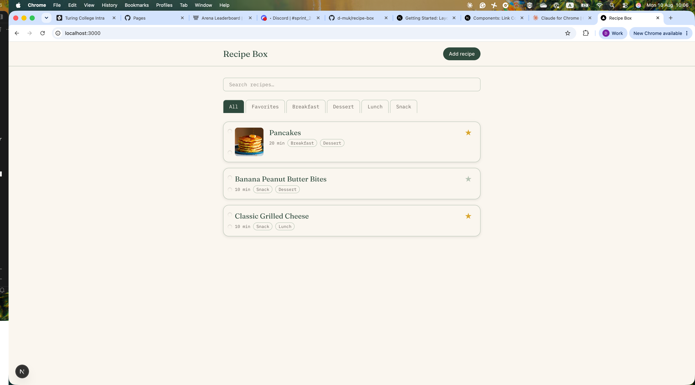

# Recipe Box

A simple recipe box app. Save, organize, and search your favorite recipes
in one place — right in your browser, no account or server required.

## What it does

- Save recipes with ingredients, instructions, prep time, and photos
- Tag recipes by category (e.g. "dinner", "dessert")
- Mark recipes as favorites — they're pinned to the top of the list, with
  the rest sorted alphabetically
- Quickly search recipes by title or ingredient

All data is stored client-side in the browser's `localStorage` — nothing
is sent to a server. See [`CLAUDE.md`](./CLAUDE.md) and
[`REFLECTION.md`](./REFLECTION.md) for more on that decision.

## Running locally

```bash
npm install
npm run dev
```

Then open [http://localhost:3000](http://localhost:3000) in your browser.

## Screenshot



## Stack

- Next.js (App Router)
- TypeScript
- Tailwind CSS
